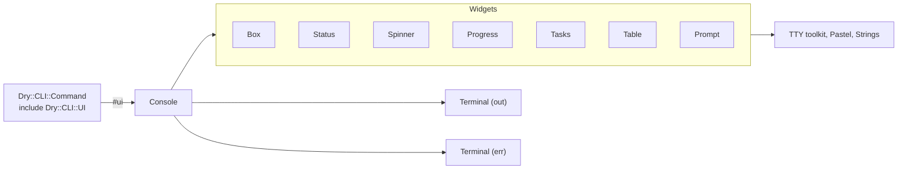

# `dry-cli-ui`

Rich runtime terminal UI for [`dry-cli`](https://github.com/dry-rb/dry-cli) commands.

## Purpose

`dry-cli-ui` gives ordinary `dry-cli` commands a high-level API for presenting their **runtime state**.

It is particularly useful for long-running commands where plain `puts` output does not adequately communicate progress, activity, warnings, failures, or completion.

It is not intended primarily as a framework for building full-screen terminal applications.

Instead, it adds rich terminal UI to normal CLI commands while preserving the familiar command-line experience and terminal scrollback.

## Responsibilities

- Spinners
- Progress bars
- Status messages
- Success messages
- Warning messages
- Error messages
- Styled boxes and panels
- Tables
- Task trees
- Nested operations
- Several operations running at once
- Elapsed time and ETA
- Interactive prompts
- Terminal-aware rendering
- Graceful fallback when ANSI/interactive output is unavailable

## Example

```ruby
class Import < Dry::CLI::Command
  include Dry::CLI::UI

  def call(**)
    ui.info "Importing tax rules..."

    ui.spinner("Loading tax rules") do
      load_rules
    end

    ui.progress("Importing rules", total: rules.size) do |bar|
      rules.each do |rule|
        import(rule)
        bar.advance
      end
    end

    ui.success "Imported #{rules.size} rules"
  rescue => e
    ui.error("Import failed", e.message)
  end
end
```

Example output, piped, when the import fails part way:

```text
Loading tax rules...
✓ Loading tax rules (0.3s)
Importing rules...
✗ Importing rules 1482/1900 (4.1s)
┌─ Error ──────────────────────────────────────────────────┐
│                                                          │
│  Import failed                                           │
│                                                          │
│  Could not validate rule US.2026.IRC.199A: missing       │
│  dependency taxable_income                               │
│                                                          │
└──────────────────────────────────────────────────────────┘
```

On a terminal the spinner turns and the bar fills in place (`Importing rules ███████░░░ 78%  1482/1900  ETA  4s`), and each is replaced by the same outcome line when its block ends.

## API

Commands depend on a small semantic API rather than directly manipulating terminal primitives:

```ruby
ui.debug(...)
ui.info(...)
ui.success(...)
ui.warn(...)
ui.error(...)
ui.fatal(...)

ui.spinner(...)
ui.progress(...)
ui.status(...)

ui.box(...)
ui.table(...)
ui.tasks(...)

ui.prompt(...)
ui.confirm(...)
```

This separates **what the command wants to communicate** from **how the terminal renders it**.

## Rendering

The implementation builds on existing Ruby terminal libraries rather than reimplementing terminal mechanics: `tty-box`, `tty-spinner`, `tty-progressbar`, `tty-table`, `tty-prompt`, `tty-cursor`, `tty-screen`, `pastel` and `strings`.

The public API does not expose these dependencies. No method returns or yields a TTY object, and no argument takes one.

That leaves open the possibility of introducing other renderers later, including richer inline TUI implementations, without changing application command code.

## Design Principle

`dry-cli-ui` owns what the user sees **while a command runs and when it finishes**.

```text
dry-cli
    │
    └── dry-cli-ui
          │
          ├── spinner
          ├── progress
          ├── status
          ├── debug/info/success/warn/error/fatal
          ├── boxes
          ├── tables
          ├── task trees
          └── prompts
```

## Relationship to dry-cli-help

The two gems deliberately have separate responsibilities:

```text
dry-cli
    │
    ├── dry-cli-help
    │     Static presentation
    │
    │     "What does this command do?"
    │
    └── dry-cli-ui
          Runtime presentation

          "What is this command doing?"
```

A CLI application can use either gem independently or combine them:

```ruby
gem "dry-cli"
gem "dry-cli-help"
gem "dry-cli-ui"
```

Together they provide richer presentation without turning `dry-cli` itself into a large terminal UI framework.

## Boxes

`debug`, `info`, `success`, `warn`, `error` and `fatal` each draw a box:

- a single-line white border,
- the level's name as a bold, coloured title in the top border (`┌─ Error ───`),
- one blank row above and below the text and two columns either side,
- each argument as its own paragraph, wrapped to fit, separated by a blank line.

The width is one of:

1. a fixed number of columns, per console (`Console.new(box_width: 72)`) or per call (`ui.info("...", width: 72)`), never wider than the terminal;
1. the whole terminal less a two-column margin, which is the default.

A box is never narrower than 20 columns. `ui.box(*paragraphs, title:, level:)` draws the same frame without a level, or with a level's styling and a different title.

| Level     | Title   | Glyph | Colour  | Stream |
| --------- | ------- | ----- | ------- | ------ |
| `debug`   | Debug   | `·`   | grey    | err    |
| `info`    | Info    | `ℹ`   | cyan    | out    |
| `success` | Success | `✓`   | green   | out    |
| `warn`    | Warning | `⚠`   | yellow  | err    |
| `error`   | Error   | `✗`   | red     | err    |
| `fatal`   | Fatal   | `✖`   | magenta | err    |

`success` and `fatal` were added to the original five (`debug`, `info`, `warn`, `error`, `fatal`) because the example above uses `success`.

## Design decisions

### Architecture



| File                          | Role                                                                       |
| ----------------------------- | -------------------------------------------------------------------------- |
| `lib/dry/cli/ui.rb`           | The mixin. Defines `#ui` and autoloads everything else.                    |
| `lib/dry/cli/ui/console.rb`   | The public API. Routes each call to a widget and a stream.                 |
| `lib/dry/cli/ui/terminal.rb`  | One stream and what it can do: TTY, animation, colour, width, height.      |
| `lib/dry/cli/ui/theme.rb`     | Levels (title, glyph, colour, stream) and operation states.                |
| `lib/dry/cli/ui/duration.rb`  | The monotonic clock and `0.4s` / `1m 02s` / `1h 02m` formatting.           |
| `lib/dry/cli/ui/widgets/*.rb` | One renderer per widget, each owning its rich form and its plain fallback. |

Only files under `widgets/` and `terminal.rb` touch a TTY class. A future renderer replaces widgets, not `Console`.

### Including costs nothing at boot

`include Dry::CLI::UI` loads the mixin and nothing else. `Console`, the widgets and every TTY gem are autoloaded on first use, so a command that never calls `ui` never loads them. A spec pins this by checking `$LOADED_FEATURES` in a fresh process.

### Streams

Results go to `out`; everything about the command's own progress goes to `err`. Piping a command therefore captures its results and nothing else.

| `out`                             | `err`                                                                      |
| --------------------------------- | -------------------------------------------------------------------------- |
| `info`, `success`, `box`, `table` | `debug`, `warn`, `error`, `fatal`, `spinner`, `progress`, `tasks`, prompts |
| `status` at `info` or `success`   | `status` at `debug`, `warn`, `error` or `fatal`                            |

`#ui` uses the command's own `out` and `err` when dry-cli has set them (`Dry::CLI#call(out:, err:)`), and `$stdout` and `$stderr` otherwise. Every write flushes, so the two streams stay in order when both are piped to the same place.

### Terminal detection and fallback

Each stream is judged on its own:

| Condition                          | Animation and cursor movement | Colour |
| ---------------------------------- | ----------------------------- | ------ |
| TTY                                | yes                           | yes    |
| TTY with `NO_COLOR` set, non-empty | yes                           | no     |
| TTY with `TERM=dumb`               | no                            | no     |
| not a TTY                          | no                            | no     |

`Console.new(color:, animate:, width:)` overrides detection. Without animation:

| Widget                | Plain output                                                                                       |
| --------------------- | -------------------------------------------------------------------------------------------------- |
| spinner               | `Label...` before the block, `✓ Label (1.2s)` or `✗ Label (1.2s)` after it                         |
| progress              | `Label...` before, `✓ Label 1900/1900 (4.2s)` after, with the count reached                        |
| tasks                 | each line printed once final: a group when it starts, a task when it ends, skipped ones at the end |
| prompts               | the question on `err`, one line read from input                                                    |
| boxes, tables, status | unchanged apart from colour                                                                        |

### Spinners and progress bars

Both run a block, return what it returns, and re-raise what it raises after marking the outcome `✗`. The elapsed time comes from a monotonic clock. `ui.progress` yields a handle with `advance(step = 1)`, `current` and `total`; progress is clamped to `0..total`, and `total: 0` is allowed.

### Task trees

The block declares the tree; nothing runs until it returns. Knowing the whole shape first is what lets the tree draw `├─` and `└─` correctly before the first task starts.

```ruby
ui.tasks("Deploy") do |t|
  t.task("Build assets") { build }
  t.group("Migrate") do |g|
    g.task("users") { migrate(:users) }
    g.task("orders") { migrate(:orders) }
  end
  t.group("Warm caches", concurrent: true) do |g|
    g.task("fonts") { warm(:fonts) }
    g.task("images") { warm(:images) }
  end
  t.task("Restart") { restart }
end
```

- Tasks run in order. A group declared `concurrent: true`, or `ui.tasks(concurrent: true)` at the top level, runs its tasks at the same time on `concurrent-ruby` futures.
- States are pending `○`, running `▸`, done `✓`, failed `✗` and skipped `–`. On an animated terminal a running task shows a turning spinner instead of `▸`, so a concurrent group is a multi-spinner.
- When a task raises, it and its enclosing groups are marked failed, tasks already running beside it finish, tasks not yet started are marked skipped, and the first error is re-raised.
- The live tree is redrawn in place with cursor movement, which cannot reach above the top of the screen. A tree with as many rows as the screen, or more, is printed line by line instead.
- Task blocks should not write to the terminal while a live tree is drawn; the next redraw overwrites their output.

### Tables

`ui.table(rows, header:)` renders with box-drawing borders and a bold header. Tables are data, so they are never narrowed, truncated or rotated to fit the screen. TTY::Table otherwise measures the screen, prints a warning on STDERR, and turns a wide table on its side.

### Prompts

`ui.prompt(question, default:, choices:)` asks for a line of text, or for one of `choices` (an Array of names, or a Hash of names to the values returned). `ui.confirm(question, default: false)` asks yes or no.

With an interactive input and output they use `tty-prompt`'s line editing and arrow-key menus. Otherwise they read lines, so answers can be piped in:

```bash
printf 'production\ny\n' | mycli deploy
```

An empty answer takes the default. An exhausted input takes the default too, and a question with no default raises `Dry::CLI::UI::NonInteractiveError` rather than inventing an answer. An answer that is not a valid choice, or not yes or no, asks again.

### A TTY::Box defect worked around

With a fixed width, TTY::Box 0.7 wraps text but sizes the box from the unwrapped lines, so everything past the first rows is silently dropped. `Widgets::Box` wraps the text with `Strings::Wrap` first, leaving TTY::Box nothing to wrap.

## Acceptance criteria

- [x] `include Dry::CLI::UI` gives a command `#ui`; including it loads no TTY gem.
- [x] `#ui` writes to the streams dry-cli was called with.
- [x] `debug`, `info`, `success`, `warn`, `error` and `fatal` draw white single-line boxes titled by level, wrapped, as wide as configured or the terminal less a margin, and never lose text.
- [x] `spinner`, `progress` and `tasks` return their block's value, re-raise its error, and leave an outcome line with the elapsed time; progress shows percent, count and ETA.
- [x] Task trees nest, run groups concurrently when asked, and mark failed and skipped tasks.
- [x] Tables render rows and a header without truncation.
- [x] Prompts work interactively and from piped input, and never block on an exhausted input.
- [x] Output that is not a TTY, or runs under `TERM=dumb`, contains no escape sequences; `NO_COLOR` removes colour.
- [x] The public API exposes no TTY object.
- [x] 100% line and branch coverage, enforced by the suite.

## Out of scope

- Full-screen applications, alternate screen buffers, and a public cursor-positioning API. TTY::Cursor and TTY::Screen are used internally only.
- Keyboard input beyond prompts.
- Renderers other than the TTY toolkit. The widget boundary allows one later.
