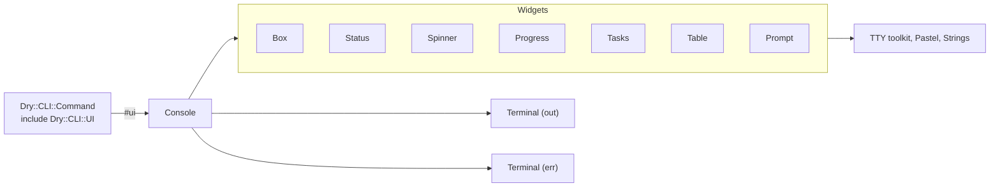

# `dry-cli-ui`

> [!NOTE]
> This is the specification for version 0.1.0 of the gem. Later versions add to it; see the [README](../README.md) for the current API.

Rich runtime terminal UI for [`dry-cli`](https://github.com/dry-rb/dry-cli) commands.

## Purpose

`dry-cli-ui` gives ordinary `dry-cli` commands a high-level API for presenting their **runtime state**.

It is particularly useful for long-running commands where plain `puts` output does not adequately communicate progress, activity, warnings, failures, or completion.

It is not intended primarily as a framework for building full-screen terminal applications.

Instead, it adds rich terminal UI to normal CLI commands while preserving the familiar command-line experience and terminal scrollback.

## Responsibilities

- Spinners
- Progress bars
- Status messages
- Success messages
- Warning messages
- Error messages
- Styled boxes and panels
- Tables
- Task trees
- Nested operations
- Several operations running at once
- Elapsed time and ETA
- Interactive prompts
- Terminal-aware rendering
- Graceful fallback when ANSI/interactive output is unavailable

## Example

```ruby
class Import < Dry::CLI::Command
  include Dry::CLI::UI

  def call(**)
    ui.info "Importing tax rules..."

    ui.spinner("Loading tax rules") do
      load_rules
    end

    ui.progress("Importing rules", total: rules.size) do |bar|
      rules.each do |rule|
        import(rule)
        bar.advance
      end
    end

    ui.success "Imported #{rules.size} rules"
  rescue => e
    ui.error("Import failed", e.message)
  end
end
```

Example output, piped, when the import fails part way:

```text
Loading tax rules...
✓ Loading tax rules (0.3s)
Importing rules...
𝘅 Importing rules 1482/1900 (4.1s)
┌─ Error ──────────────────────────────────────────────────┐
│                                                          │
│  Import failed                                           │
│                                                          │
│  Could not validate rule US.2026.IRC.199A: missing       │
│  dependency taxable_income                               │
│                                                          │
└──────────────────────────────────────────────────────────┘
```

On a terminal the spinner turns and the bar fills in place (`Importing rules ███████░░░ 78%  1482/1900  ETA  4s`), and each is replaced by the same outcome line when its block ends.

## API

Commands depend on a small semantic API rather than directly manipulating terminal primitives:

```ruby
ui.debug(...)
ui.info(...)
ui.success(...)
ui.warn(...)
ui.error(...)
ui.fatal(...)

ui.spinner(...)
ui.multi_spinner(...)
ui.progress(...)
ui.multi_progress(...)
ui.status(...)
ui.status_bar(...)

ui.box(...)
ui.popup(...)
ui.table(...)
ui.tasks(...)

ui.prompt(...)
ui.confirm(...)
```

This separates **what the command wants to communicate** from **how the terminal renders it**.

## Rendering

The implementation builds on existing Ruby terminal libraries rather than reimplementing terminal mechanics: `tty-box`, `tty-spinner`, `tty-progressbar`, `tty-table`, `tty-prompt`, `tty-cursor`, `tty-screen`, `pastel` and `strings`.

The public API does not expose these dependencies. No method returns or yields a TTY object, and no argument takes one.

That leaves open the possibility of introducing other renderers later, including richer inline TUI implementations, without changing application command code.

## Design Principle

`dry-cli-ui` owns what the user sees **while a command runs and when it finishes**.

```text
dry-cli
    │
    └── dry-cli-ui
          │
          ├── spinner
          ├── progress
          ├── status
          ├── debug/info/success/warn/error/fatal
          ├── boxes
          ├── tables
          ├── task trees
          └── prompts
```

## Relationship to dry-cli-help

The two gems deliberately have separate responsibilities:

```text
dry-cli
    │
    ├── dry-cli-help
    │     Static presentation
    │
    │     "What does this command do?"
    │
    └── dry-cli-ui
          Runtime presentation

          "What is this command doing?"
```

A CLI application can use either gem independently or combine them:

```ruby
gem "dry-cli"
gem "dry-cli-help"
gem "dry-cli-ui"
```

Together they provide richer presentation without turning `dry-cli` itself into a large terminal UI framework.

## Boxes

`debug`, `info`, `success`, `warn`, `error` and `fatal` each draw a box:

- a single-line white border,
- the level's name as a bold, coloured title in the top border (`┌─ Error ───`),
- one blank row above and below the text and two columns either side,
- each argument as its own paragraph, wrapped to fit, separated by a blank line.

The width is one of:

1. a fixed number of columns, per console (`Console.new(box_width: 72)`) or per call (`ui.info("...", width: 72)`), never wider than the terminal;
1. the whole terminal less a two-column margin, which is the default.

A box is never narrower than 20 columns. `ui.box(*paragraphs, title:, level:)` draws the same frame without a level, or with a level's styling and a different title.

| Level     | Title   | Glyph | Colour  | Stream |
| --------- | ------- | ----- | ------- | ------ |
| `debug`   | Debug   | `·`   | grey    | err    |
| `info`    | Info    | `ℹ`   | cyan    | out    |
| `success` | Success | `✓`   | green   | out    |
| `warn`    | Warning | `⚠`   | yellow  | err    |
| `error`   | Error   | `✗`   | red     | err    |
| `fatal`   | Fatal   | `✖`   | magenta | err    |

`success` and `fatal` were added to the original five (`debug`, `info`, `warn`, `error`, `fatal`) because the example above uses `success`.

## Design decisions

### Architecture



| File                          | Role                                                                       |
| ----------------------------- | -------------------------------------------------------------------------- |
| `lib/dry/cli/ui.rb`           | The mixin. Defines `#ui` and autoloads everything else.                    |
| `lib/dry/cli/ui/console.rb`   | The public API. Routes each call to a widget and a stream.                 |
| `lib/dry/cli/ui/terminal.rb`  | One stream and what it can do: TTY, animation, colour, width, height.      |
| `lib/dry/cli/ui/theme.rb`     | Levels (title, glyph, colour, stream) and operation states.                |
| `lib/dry/cli/ui/duration.rb`  | The monotonic clock and `0.4s` / `1m 02s` / `1h 02m` formatting.           |
| `lib/dry/cli/ui/widgets/*.rb` | One renderer per widget, each owning its rich form and its plain fallback. |

Only files under `widgets/` and `terminal.rb` touch a TTY class. A future renderer replaces widgets, not `Console`.

### Including costs nothing at boot

`include Dry::CLI::UI` loads the mixin and nothing else. `Console`, the widgets and every TTY gem are autoloaded on first use, so a command that never calls `ui` never loads them. A spec pins this by checking `$LOADED_FEATURES` in a fresh process.

### Streams

Results go to `out`; everything about the command's own progress goes to `err`. Piping a command therefore captures its results and nothing else.

| `out`                             | `err`                                                                                                                                |
| --------------------------------- | ------------------------------------------------------------------------------------------------------------------------------------ |
| `info`, `success`, `box`, `table` | `debug`, `warn`, `error`, `fatal`, `popup`, `spinner`, `multi_spinner`, `progress`, `multi_progress`, `tasks`, `status_bar`, prompts |
| `status` at `info` or `success`   | `status` at `debug`, `warn`, `error` or `fatal`                                                                                      |

`#ui` uses the command's own `out` and `err` when dry-cli has set them (`Dry::CLI#call(out:, err:)`), and `$stdout` and `$stderr` otherwise. Every write flushes, so the two streams stay in order when both are piped to the same place.

### Terminal detection and fallback

Each stream is judged on its own:

| Condition                          | Animation and cursor movement | Colour |
| ---------------------------------- | ----------------------------- | ------ |
| TTY                                | yes                           | yes    |
| TTY with `NO_COLOR` set, non-empty | yes                           | no     |
| TTY with `TERM=dumb`               | no                            | no     |
| not a TTY                          | no                            | no     |

`Console.new(color:, animate:, width:)` overrides detection. Without animation:

| Widget                | Plain output                                                                                                                                                                     |
| --------------------- | -------------------------------------------------------------------------------------------------------------------------------------------------------------------------------- |
| spinner               | `Label...` before the block, `✓ Label (1.2s)` or `𝘅 Label (1.2s)` after it; a `Line`'s detail is never printed, a `Line#fail` reason follows the label: `𝘅 Label: reason (1.2s)` |
| progress              | `Label...` before, `✓ Label 1900/1900 (4.2s)` after, with the count reached                                                                                                      |
| multi_spinner         | `Title...` before, each job's outcome indented as it ends, skipped ones at the end, then the headline's outcome                                                                  |
| multi_progress        | as multi_spinner, each outcome with its count: `✓ a.zip 40/40 (0.1s)`, and the headline with the total count                                                                     |
| tasks                 | each line printed once final: a group when it starts, a task when it ends, skipped ones at the end                                                                               |
| prompts               | the question on `err`, one line read from input                                                                                                                                  |
| boxes, tables, status | unchanged apart from colour                                                                                                                                                      |
| popup                 | the same box `ui.box` draws, on `err`, where the output scrolls rather than over it                                                                                              |

### Spinners and progress bars

Both run a block, return what it returns, and re-raise what it raises after marking the outcome `𝘅`. The elapsed time comes from a monotonic clock. `ui.progress` yields a handle with `advance(step = 1)`, `current` and `total`; progress is clamped to `0..total`, and `total: 0` is allowed.

`ui.spinner` yields a `Dry::CLI::UI::Line`, the same handle every task in a tree is given:

| Method          | Effect                                                                                                   |
| --------------- | -------------------------------------------------------------------------------------------------------- |
| `detail = text` | Text after the label while the work runs, redrawn in place when animated; kept, never printed, otherwise |
| `detail`        | The current text, `""` for none                                                                          |
| `fail(reason)`  | Ends the work as `𝘅 label: reason` when the block returns, without raising; the reason is optional       |
| `failed?`       | Whether `fail` was called                                                                                |
| `reason`        | What `fail` was given                                                                                    |

Every method may be called from any thread, which is how work that reports from a reader thread (a child process's output, say) updates its line. A block that ignores the line works as before, and so does a lambda that takes no arguments. The detail is never printed without animation because it can change many times a second, and a log of every change is not what a pipe asked for.

A spinner whose block calls `fail` still returns the block's value. That is the difference from raising: the work finished and has a result, and the result is that it did not succeed.

### Several at once: `multi_spinner` and `multi_progress`

```ruby
ui.multi_spinner("Fetching", concurrent: 2) do |m|
  m.spinner("fonts") { fetch(:fonts) }
  m.spinner("images") { |line| fetch(:images) { |n| line.detail = "#{n} of 40" } }
end

ui.multi_progress("Downloading") do |m|
  files.each { |f| m.progress(f.name, total: f.size) { |bar| download(f) { |n| bar.advance(n) } } }
end
```

- The block declares the jobs; nothing runs until it returns, so every row, including those of jobs waiting under a concurrency limit, is drawn before the first job starts. TTY::Spinner::Multi and TTY::ProgressBar::Multi give a row only to a job that has started and move the cursor relative to the last row drawn, which is why these widgets draw their rows themselves, as task trees do.
- Jobs run all at once by default. `concurrent:` takes the same values as on `ui.tasks`, with the same meaning.
- The call returns what each job returned, in declaration order, and `nil` for a job that never ran.
- The headline turns while any job runs and ends `✓` when every job succeeded, `𝘅` otherwise. Every row, the headline's included, is marked in brackets as task rows are: `[ ]` while waiting, a turning `[⠏]` while running, then `[✓]`, `[𝘅]` or `[—]` with its elapsed time.
- `multi_spinner` gives each job a `Line`; its detail follows the label while the job runs, and `fail` marks the job `𝘅 label: reason` without raising. `multi_progress` gives each job a `Widgets::Progress::Handle`; its row shows a bar, a percentage, a count and an ETA, and the headline's bar counts every job. Labels are padded so every bar starts and ends in the same columns.
- When a job raises, jobs already running finish, jobs not yet started are marked skipped, and the first error is re-raised.
- As with task trees, rows are redrawn in place only when they all fit on the screen; otherwise they print as without animation.

### Configuration

`Dry::CLI::UI.configure` sets how every spinner and bar in the process looks. A `Console` reads `Dry::CLI::UI.config` unless given `config:`.

| Setting          | Takes                                                                        | Default                              | Draws                              |
| ---------------- | ---------------------------------------------------------------------------- | ------------------------------------ | ---------------------------------- |
| `spinner_format` | A `TTY::Formats::FORMATS` name, or `{ interval:, frames: }`                  | `:dots`                              | `⠋ ⠙ ⠹ ⠸ ⠼ ⠴ ⠦ ⠧ ⠇ ⠏`, 10 a second |
| `bar_format`     | A `TTY::ProgressBar::Formats::FORMATS` name, or `{ complete:, incomplete: }` | `{ complete: "◼", incomplete: " " }` | `[◼◼◼   ]`                         |
| `bar_color`      | A Pastel style, or nil                                                       | `:green`                             | The finished part of every bar     |
| `bar_background` | A Pastel style, or nil                                                       | `nil`                                | The whole of every bar, a track    |

An unknown name, a malformed definition or a style Pastel does not know raises `ArgumentError` when it is set, not when a spinner first turns. Loading the configuration loads only the two format tables and Pastel, never a TTY widget. Colours follow the stream, as everything else does: without colour a bar is its characters alone, and the brackets show its extent.

Every count in a `multi_progress` is right-aligned to the widest any row can show, the headline's total, so `8/503` and `1/8` end in the same column.

### Status bar

`ui.status_bar(title = nil, hints: [])` keeps two rows at the bottom of the screen while its block runs: a rule, then

```text
 ⠸ deploy · fonts.zip · 2 running · 2 done · [◼◼◼       ] 37% · 0.4s            ^C cancel
```

- The glyph turns while anything runs. Then come the title in bold, the label of the work started most recently, the counts of what is running, done and failed, a bar over every progress bar reported so far, finished or not, and the elapsed time. Hints are right-aligned when they fit and left out when they do not; a status too wide for the screen is truncated with `…`.
- Every `spinner`, `progress`, `multi_spinner` and `multi_progress` job, and every task (not group) in a tree, reports its start and end to the bar through its `Terminal`. Commands supply only the title and the hints.
- It is drawn at the bottom rather than pinned to the top. Pinning a top row needs a scroll region, terminals such as iTerm2 and tmux drop lines scrolled out of a region from the scrollback, and a crash that skips cleanup leaves the region set. A bottom line needs neither.
- While it runs, the console's terminals write through a `StatusBar::Output`. Each write clears from the cursor to the end of the screen, writes, draws the rule and status line below, and moves the cursor back to where the write left it, in one write to the stream. The column is followed through the text, carriage returns, `CSI n G/C/D` and cursor save and restore, so a spinner redrawing its own line keeps working. The status line alone is redrawn ten times a second.
- `Terminal#height` is two rows short while it runs, so live widgets fall back to plain output two rows sooner.
- `out` writes through it too when `out` is animated, since both streams share the screen. Writes that bypass the console land where the bar is until the next write draws over them.
- Without an animated `err`, and inside another status bar, it only runs the block.

### Task trees

The block declares the tree; nothing runs until it returns. Knowing the whole shape first is what lets the tree draw `├─` and `└─` correctly before the first task starts.

```ruby
ui.tasks("Deploy") do |t|
  t.task("Build assets") { build }
  t.group("Migrate") do |g|
    g.task("users") { migrate(:users) }
    g.task("orders") { migrate(:orders) }
  end
  t.group("Warm caches", concurrent: true) do |g|
    g.task("fonts") { warm(:fonts) }
    g.task("images") { warm(:images) }
  end
  t.task("Restart") { restart }
end
```

- Tasks run in order. A group declared `concurrent: true`, or `ui.tasks(concurrent: true)` at the top level, runs its tasks at the same time on `concurrent-ruby` futures. `concurrent: 3` runs at most three at once, taking tasks in declaration order as each finishes. Anything but `true`, `false` or a positive Integer raises `ArgumentError`.
- Each task is given a `Line`. Its detail is drawn after the task's name while it runs, on a live tree only. A task that calls `fail` is marked `𝘅 name: reason`, every group above it ends `𝘅`, and the rest of the tree runs on: nothing is skipped and nothing is raised.
- Each row is marked with its state in brackets: pending `[ ]` and running `[▸]` in bold yellow, done `[✓]` in green, failed `[𝘅]` in red and skipped `[—]` in yellow. On an animated terminal a running task shows a turning spinner instead, `[⠏]`, drawn from the configured spinner format, so a concurrent group is a multi-spinner.
- When a task raises, it and its enclosing groups are marked failed, tasks already running beside it finish, tasks not yet started are marked skipped, and the first error is re-raised. Under a concurrency limit, no further task is started once one has raised.
- The live tree is redrawn in place with cursor movement, which cannot reach above the top of the screen. A tree with as many rows as the screen, or more, is printed line by line instead.
- Task blocks should not write to the terminal while a live tree is drawn; the next redraw overwrites their output.

### Popups

`ui.popup(*paragraphs, title:, width:)` draws a box on `err` over whatever the terminal is showing, such as a key reference over a running spinner. On an animated terminal it is:

- as wide as its widest line or its title needs, never narrower than 20 columns and never wider than the box width (`width:`, then the console's `box_width`, then the terminal less the margin);
- centred on the screen by absolute cursor positioning;
- wrapped in a cursor save and restore, with no trailing newline, so it neither moves the cursor nor scrolls the screen.

Whatever redraws that part of the screen next draws over it, which is all the dismissal a popup needs. Without animation the output cannot be drawn over, so it is the box `ui.box` draws, on `err`.

### Tables

`ui.table(rows, header:)` renders with box-drawing borders and a bold header. Tables are data, so they are never narrowed, truncated or rotated to fit the screen. TTY::Table otherwise measures the screen, prints a warning on STDERR, and turns a wide table on its side.

### Prompts

`ui.prompt(question, default:, choices:)` asks for a line of text, or for one of `choices` (an Array of names, or a Hash of names to the values returned). `ui.confirm(question, default: false)` asks yes or no.

With an interactive input and output they use `tty-prompt`'s line editing and arrow-key menus. Otherwise they read lines, so answers can be piped in:

```bash
printf 'production\ny\n' | mycli deploy
```

An empty answer takes the default. An exhausted input takes the default too, and a question with no default raises `Dry::CLI::UI::NonInteractiveError` rather than inventing an answer. An answer that is not a valid choice, or not yes or no, asks again.

### A TTY::Box defect worked around

With a fixed width, TTY::Box 0.7 wraps text but sizes the box from the unwrapped lines, so everything past the first rows is silently dropped. `Widgets::Box` wraps the text with `Strings::Wrap` first, leaving TTY::Box nothing to wrap.

## Acceptance criteria

- [x] `include Dry::CLI::UI` gives a command `#ui`; including it loads no TTY gem.
- [x] `#ui` writes to the streams dry-cli was called with.
- [x] `debug`, `info`, `success`, `warn`, `error` and `fatal` draw white single-line boxes titled by level, wrapped, as wide as configured or the terminal less a margin, and never lose text.
- [x] `spinner`, `progress` and `tasks` return their block's value, re-raise its error, and leave an outcome line with the elapsed time; progress shows percent, count and ETA.
- [x] Task trees nest, run groups concurrently when asked, at most as many at once as asked, and mark failed and skipped tasks.
- [x] `multi_spinner` and `multi_progress` run declared jobs at once, at most as many as asked, draw every row including waiting ones, return each job's value, and mark failed and skipped jobs.
- [x] `Dry::CLI::UI.configure` sets the spinner frames, bar characters and bar colours every widget draws with, and rejects unknown formats and styles when set.
- [x] `status_bar` keeps an automatically fed status line below everything the command prints, restores the cursor after every write, leaves the scrollback intact, and removes itself when the block ends or raises.
- [x] Spinner and task blocks get a thread-safe `Line` whose detail is drawn while they run, and which can fail them without raising.
- [x] `popup` draws a content-sized, centred box that leaves the cursor where it was, and a plain box without animation.
- [x] Tables render rows and a header without truncation.
- [x] Prompts work interactively and from piped input, and never block on an exhausted input.
- [x] Output that is not a TTY, or runs under `TERM=dumb`, contains no escape sequences; `NO_COLOR` removes colour.
- [x] The public API exposes no TTY object.
- [x] 100% line and branch coverage, enforced by the suite.

## Out of scope

- Full-screen applications, alternate screen buffers, scroll regions, and a public cursor-positioning API. TTY::Cursor and TTY::Screen are used internally only; `popup` positions itself, and takes no coordinates.
- Keyboard input beyond prompts.
- Renderers other than the TTY toolkit. The widget boundary allows one later.
